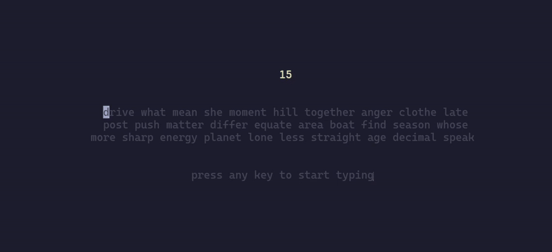

# Keyzen - Fast Terminal Typing Test

A beautiful and fast typing test that runs in your terminal. Test your typing speed with programming languages, English words, or custom text.

<div align="center">

</div>

## Features

- 🚀 **Fast & Beautiful**: Clean TUI with real-time stats
- 🎯 **Multiple Languages**: Support for 35+ programming languages
- ⏱️ **Customizable Duration**: Set your own test duration
- 📊 **Real-time Stats**: WPM, accuracy, and time tracking
- 🎨 **Color-coded Results**: Performance-based color coding
- 🔄 **Restart Support**: Quick restart after each test

## Installation

### Quick Install

```bash
git clone https://github.com/akshitvigg/keyzen
cd keyzen
./install.sh
```

### Manual Install

```bash
# Build the project
cargo build --release

# Install to system (choose one):
# Option 1: System-wide (requires sudo)
sudo ln -sf "$(pwd)/target/release/keyzen" /usr/local/bin/keyzen

# Option 2: User-local
mkdir -p ~/.local/bin
ln -sf "$(pwd)/target/release/keyzen" ~/.local/bin/keyzen
# Add ~/.local/bin to your PATH if not already there
```

## Usage

### Basic Commands

```bash
# Start a 30-second English typing test (default)
keyzen start

# Start a 60-second typing test
keyzen start --duration 60
# or
keyzen start -d 60

# Start a Rust keywords typing test
keyzen start --lang rust
# or
keyzen start -l rust

# Combine duration and language
keyzen start --duration 45 --lang javascript
# or
keyzen start -d 45 -l javascript

# List all available languages
keyzen start --list-langs

# Get help
keyzen --help
keyzen start --help
```

### Available Languages

Run `keyzen start --list-langs` to see all available languages. Includes:

- **Programming Languages**: rust, python, javascript, java, c++, go, etc.
- **Markup**: html, css, json, yaml, tex
- **Shell**: bash, powershell
- **General**: english (1000 common words)

## Controls

### During Test

- **Type normally** to progress through words
- **Backspace** to correct mistakes
- **Tab** to restart the test
- **Esc** to quit

### Results Screen

- **Tab** to restart
- **Esc** to quit

## Performance Colors

Results are color-coded based on performance:

- 🟢 **Green**: Excellent (60+ WPM, 95%+ accuracy)
- 🔵 **Cyan**: Good (40-59 WPM, 80-94% accuracy)
- 🟡 **Yellow**: Fair (20-39 WPM, <80% accuracy)
- 🔴 **Red**: Needs improvement (<20 WPM, <80% accuracy)

## Development

```bash
# Run in development mode
cargo run -- start -d 10 -l javascript

# Build for release
cargo build --release

# Run tests
cargo test
```

## Requirements

- Rust 1.70+
- Linux/macOS/Windows (with terminal support)

## License

MIT License
